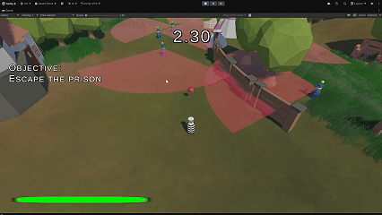

# Stealth Game (Unity, C#)

> Source code is private per UCSC course policy. This repo showcases the project; happy to walk through the systems in an interview.

Sneak past the guards and escape! A 3-level stealth game built by a team of 5 in UCSC CMPM 125 (2026). You have limited sprint, can distract guards with a throwable item, and can hide behind obstacles.

<!--  -->

## Features
Guard state machine, raycast vision detection, custom player and camera movement, 3 levels of increasing difficulty, throwable distraction item, grass shader, sound effects, menu and settings.

## My role
- **Guard AI:** state machine (patrol → chase → return) driving NavMesh agents, with raycast vision cones
- **Player movement and custom camera** across all 3 levels
- **Debugging and integration:** NavMesh and terrain setup, occlusion culling, UI anchoring and canvas scaling, Git branch management

## What I learned
Coordinating a team of 5 with different visions, coding conventions, and schedules: we split the work by system and shipped all 3 levels on time.

## Team
Alina Stasi, Ethan Akiyama, Joseph Coulson, Joseph Dadlez, and Colin Huang
